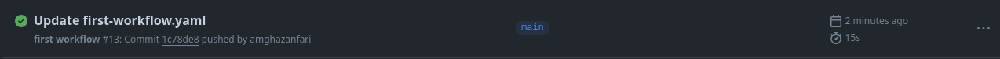
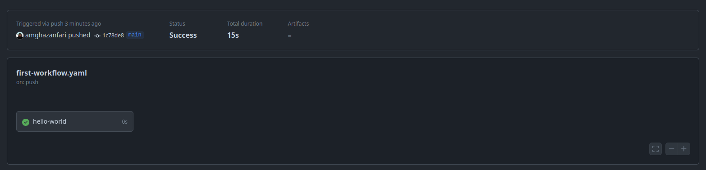
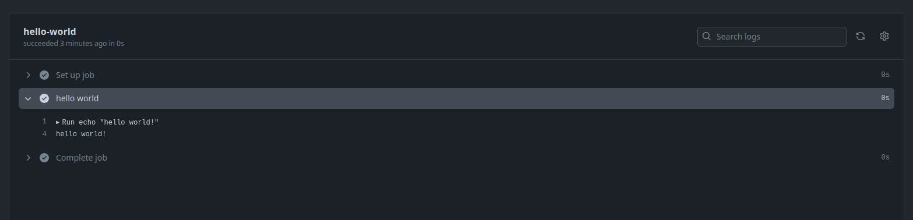

# Architecture of github actions

GitHub Actions is a robust CI/CD tool that allows developers to automate workflows directly within their GitHub repositories. A key aspect of GitHub Actions is its ability to trigger jobs based on specific events. This chapter provides a step-by-step explanation of how GitHub Actions triggers a job, illustrating the seamless automation process that occurs when certain conditions are met, and overall architecture of github actions

## Step-by-Step Process

1. **Event Occurrence**:
   An event occurs in the repository, such as a push to a branch, a pull request, or a scheduled event. This event acts as a trigger for the workflow.

2. **Workflow File Detection**:
   GitHub searches the `.github/workflows` directory in the repository for workflow files that are associated with the commit SHA or Git ref of the event. The workflow files define the conditions under which they should be triggered using the `on` key.

3. **Workflow Run Initiation**:
   If the event matches the conditions specified in the `on` key of a workflow file, a workflow run is initiated. The workflow run will use the version of the workflow present in the commit SHA or Git ref associated with the event.

4. **Job Execution**:
   Within the workflow, jobs are defined. Each job consists of a series of steps that run on the same runner. Jobs can be configured to run in parallel or sequentially, depending on their dependencies.

5. **Runner Assignment**:
   A runner, which is a virtual machine provided by GitHub or self-hosted, picks up the job and executes the steps defined in it. Each step can involve running scripts or actions, which are reusable code packages.

6. **Completion and Reporting**:
   Once all the steps in a job are executed, the runner reports the results back to GitHub. If there are multiple jobs, they will continue to run based on their defined sequence or parallel execution settings.

This process allows GitHub Actions to automate various tasks such as building, testing, and deploying code in response to specific events in the repository.

## first look at github actions

now we are going to write our first workflow. for this one create a repository and in `.github/workflows/first_workflow.yaml` write these lines:

```yaml
name: first workflow

on:
  push:

jobs:
  hello-world:
    runs-on: ubuntu-latest
    steps:
      - name: hello world
        run: echo "hello world!"
```

after commit and pushing your code, go to Actions tab in your repository page. then you can see your action. after clicking on that you can see your action step by step







congratulation! you write your first workflow. now let's see what you were writing.

the first part is the name of workflow and in the second picture you can see it.

the second part is saying in which event the workflow runs. there are many events in github actions, such as push, pull_request, issues, etc. you also can set to job starts manually.

the third part is the jobs of workflow. each job contains one or more steps. and you must say it runs in which OS. your options are ubuntu, windows, and macos
