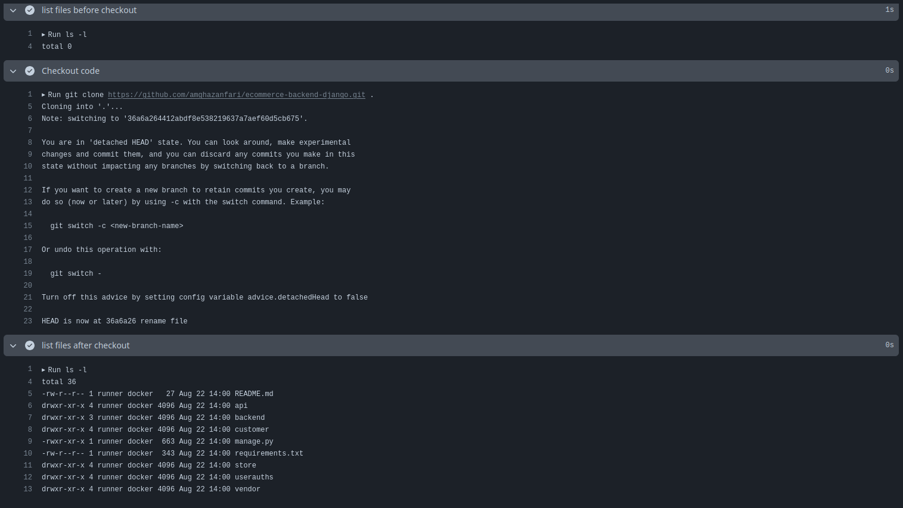
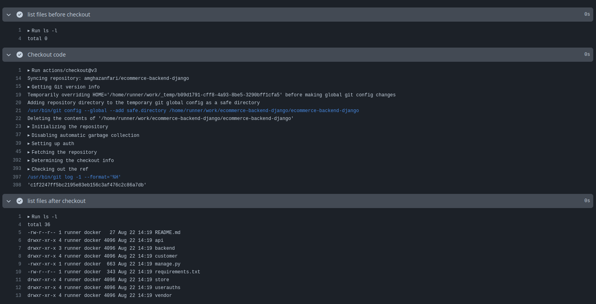

# Architecture of github actions

GitHub Actions is a robust CI/CD tool that allows developers to automate workflows directly within their GitHub repositories. A key aspect of GitHub Actions is its ability to trigger jobs based on specific events. This chapter provides a step-by-step explanation of how GitHub Actions triggers a job, illustrating the seamless automation process that occurs when certain conditions are met, and overall architecture of github actions

## Step-by-Step Process

1. **Event Occurrence**:
   An event occurs in the repository, such as a push to a branch, a pull request, or a scheduled event. This event acts as a trigger for the workflow.

2. **Workflow File Detection**:
   GitHub searches the `.github/workflows` directory in the repository for workflow files that are associated with the commit SHA or Git ref of the event. The workflow files define the conditions under which they should be triggered using the `on` key.

3. **Workflow Run Initiation**:
   If the event matches the conditions specified in the `on` key of a workflow file, a workflow run is initiated. The workflow run will use the version of the workflow present in the commit SHA or Git ref associated with the event.

4. **Job Execution**:
   Within the workflow, jobs are defined. Each job consists of a series of steps that run on the same runner. Jobs can be configured to run in parallel or sequentially, depending on their dependencies.

5. **Runner Assignment**:
   A runner, which is a virtual machine provided by GitHub or self-hosted, picks up the job and executes the steps defined in it. Each step can involve running scripts or actions, which are reusable code packages.

6. **Completion and Reporting**:
   Once all the steps in a job are executed, the runner reports the results back to GitHub. If there are multiple jobs, they will continue to run based on their defined sequence or parallel execution settings.

This process allows GitHub Actions to automate various tasks such as building, testing, and deploying code in response to specific events in the repository.

## first look at github actions

now we are going to write our first workflow. we will create our first workflow using GitHub Actions. Follow these steps to get started:

1. **Create a Repository**: Begin by creating a new repository on GitHub.

2. **Add a Workflow File**: In your repository, create a file at the path `.github/workflows/first_workflow.yaml` and add the following content:

   ```yaml
   name: First Workflow

   on:
     push:

   jobs:
     hello-world:
       runs-on: ubuntu-latest

       steps:
         - name: Hello World
           run: echo "Hello, world!"
   ```

3. **Commit and Push**: After adding the workflow file, commit your changes and push them to the repository.

4. **View the Workflow**: Navigate to the "Actions" tab on your repository's GitHub page. You will see your workflow listed there. Click on it to view the execution steps.

   

   

   

ongratulations! You've successfully created your first workflow. Now, let's break down what each part of the workflow does:

**Workflow Name**: The first part specifies the name of the workflow, which is visible in the Actions tab (as shown in the second image).

**Trigger Event**: The on section defines the event that triggers the workflow. In this example, the workflow runs on a push event. GitHub Actions supports various events such as push, pull_request, issues, and more. You can also configure workflows to start manually.

**Jobs**: The jobs section defines the tasks to be executed. Each job consists of one or more steps and specifies the operating system on which it runs. Available options include Ubuntu, Windows, and macOS.

## multisteps jobs

In GitHub Actions, a job is a set of steps that execute on the same runner. By breaking down your workflow into multiple steps within a job, you can create more organized, modular, and maintainable automation processes.

### Key Benefits:

**Modularity**: Each step can focus on a specific task, making the workflow easier to understand and maintain.

**Reusability**: Steps can be reused across different jobs and workflows.

**Error Handling**: If one step fails, subsequent steps can be skipped, allowing for better error management.

**Visibility**: Multi-step jobs provide clearer logs and status updates for each part of the process.

```yaml
name: Checkout and list files

on:
  push:

jobs:
  checkout_and_list_files:
    runs-on: ubuntu-latest
    steps:
      - name: list files before checkout
        run: ls -l

      - name: Checkout code
        run: |
          git clone https://github.com/${{ github.repository }}.git .
          git checkout ${{ github.sha }}

      - name: list files after checkout
        run: ls -l
```

github actions does not get the source code by default, the reason is that github actions used for more than ci/cd. if you want the code you should fetch it first. soon we see better ways to get the codes using actions but for now you see three steps that runs sequentially in the first `ls` you don't see anything. then you fetch the code and now if you use `ls` you see the files



## What is an action

An action is a reusable, self-contained unit of code that performs a specific task within a GitHub Actions workflow. Think of actions as building blocks that you can combine to create custom automation workflows for your projects.

### Key Characteristics of Actions

**Modularity:** Actions are designed to be modular, allowing you to break down complex processes into smaller, manageable components.

**Reusability:** Once created, actions can be shared and reused across multiple workflows and projects.

**Flexibility:** Actions can be written in JavaScript or packaged as Docker containers, providing flexibility in implementation.

### Types of Actions

**JavaScript Actions:** These run directly on the runner machine and are faster to execute.

**Docker Container Actions:** These run in a Docker container, providing a consistent and isolated environment.

**Composite Actions:** These combine multiple workflow steps within a single action.

### Let's make it with actions

in prevous code we write a workflow that fetch the code. now we can use it with actions. there is an action named `checkout` that use to checkout the code

```yaml
name: Checkout and list files

on:
  push:

jobs:
  checkout_and_list_files:
    runs-on: ubuntu-latest
    steps:
      - name: list files before checkout
        run: ls -l

      - name: Checkout code
        uses: actions/checkout@v3

      - name: list files after checkout
        run: ls -l
```


